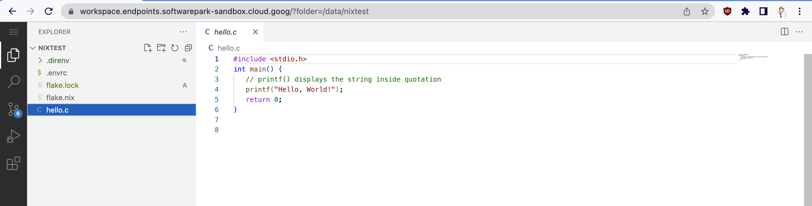

// INTERNAL! delete this section before sharing.

Rinat: this is an artifact from "Scaling ML" line of development. Current status - private. Concrete steps:

0. Done: Sergey and Rinat draft the workspace bueprint. Run Trustbit Brownbag on Nix workspace to share the knowledge.
1. Done: Rinat writes preface that targets CEO/CTO audience and could be used to draft a blog post.
2. DSML team (Seb, Christoph, Vadim and Jörg) decides if it is OK to open source this specific project.
3. Marketing takes over the content and converts into a blog post (regardless of OSS decision, but affects the blog post).
4. Vadim: introduces workspace to Walter Group to users of workspace v1 (something they can use for free. Discuss the support implications with Jörg, Christoph and Seb first).
5. Sergey: mentions workspace at VEROO to users of workspace v1 (something they can use for free. Discuss the support implications with Jörg, Christoph and Seb first).

// end of section to delete. INTERNAL

Data Science Platform Workspace
===============================

> If you are here for Nix and reproducible work environments, scroll to the next section :)

Current business landscape is changing rapidly. Software is driving that change across multiple directions: digitalization, sustainability, AI/ML. 

Have you heard about Generative AIs (ChatGPT, StableDiffusion, DALL-E)? Although, they are just a tip of the iceberg, they alone can be enough to influence [money allocation in the industry](https://a16z.com/2023/01/19/who-owns-the-generative-ai-platform/).

**Have you heard about the recent big tech lay-offs** by Google, Meta, Amazon, Microsoft and many others? They are doing that to get lean and pivot towards the new market trends (arguably, [these layoffs are also not that large on the global scale](https://www.marketwatch.com/story/big-tech-layoffs-are-not-as-big-as-they-appear-at-first-glance-11674251270)).

Large and small companies alike face the similar problem: **you need the right talent to address new challenges**, you need **more capacity to allocate**. Data Scientists, ML Engineers, MLOps, Product Leads with understanding of DS/ML.

There are two ways companies could handle this problem at the root:

1) Hire more people - attract the talent, while competing with every other company on the labour market.
2) Make existing people more happy and productive, while also improving retention.

Both of these are existential problems. They require strategy, organisational support and execution. 

This Github project is an example of a solution by Trustbit, part of a Data Science Platform. It demonstrates one tactical approach of dealing with a company-scale problem.

## Trustbit Worskpace 

This repository contains sample code for the Trustbit Data Science workspace. It demonstrates how to **quickly launch a secure and flexible work environment for data scientists in a cloud**. This allows them to get started on a project in a familiar and powerful environment that can be tailored to their needs.

Why is this important?

1. Data Scientists are more productive when they can use latest tools, code and frameworks. Productive data scientists are more satistfied with their jobs and hence more likely to stay around longer.
2. Frequent bottleneck in daily productivity is about not having enough processing power to train or evaluate a model. Somethimes, not having access to dedicated hardware like NVidia GPUs. By utilising cloud we give data scientists ability to scale out their work environment to handle larger workloads, if needed.

This setup uses Terraform and Nix to provide webIDE based on vscode-server. For small-scale deployments, it is comparable in speed to a classical VM setup based on Docker or bash scripts. It also introduces the flexibility of installing new dependencies (CUDA, Python, native binaries) with the ability to roll back changes.

**For large-scale deployments** (more than 5 workspaces), this setup is **more secure and convenient to  maintain**. Why is this important?

While data scientists like to bring their own tools and dependencies into projects, this can quickly escalate into a maintenance nightmare for the operations people. Larger is the department, higher is the chance of time-consuming problems for both sides. 

Check out this tweet by François Chollet, "Deep learning @google. Creator of Keras. Author of 'Deep Learning with Python'."

<blockquote class="twitter-tweet" data-lang="en" data-theme="dark">
Been working with Python for 13 years and I still occasionally end up with a hopelessly borked environment where I have to actually nuke and reinstall the Python interpreter. And yes, I use virtualenv
&mdash; François Chollet (@fchollet) <a href="https://twitter.com/fchollet/status/1617704787235176449?ref_src=twsrc%5Etfw">January 24, 2023</a></blockquote> 

By using Nix we turn the workspace into **reproducible, declarative and reliable systems**. Data scientists could safely apply their own configurations, while Ops could rebuild the entire fleet with the latest updates and security patches.

This approach allows data scientists to be creative with their workspace, while allowing operations to maintain a fleet of workspaces in a uniform and reliable manner.

Availability of a powerful and flexible workspace environment not only make people more productive, but also is an attractive perk to bring to hiring interviews.

This approach could be further extended by having **reproducible, declarative and reliable project dependencies** that are shared between the collaborators, operations and maintanenance. Current workspace is designed to support that (via Nix flakes), but that is a subject for another sample Trustbit solution. Also a part of Trustbit Data Science Platform.

## setup content:

[Openvscode server](https://code.visualstudio.com/docs/remote/vscode-server), a service that you can run on a remote development machine, like Google Cloud Compute Instance. It allows you to securely connect to that remote machine from anywhere through a local VS Code client, without the requirement of SSH:

In this setup SSL and http connection serves [nginx web server](https://www.nginx.com/) with [letsencrypt SSL service provider](https://letsencrypt.org/):

* [terraform](https://registry.terraform.io/providers/hashicorp/google/latest/docs) code that creates google cloud resources.
* [nix DSL](https://nixos.wiki/wiki/Overview_of_the_Nix_Language) code that setup compute server and services.

### terraform creates the following resources:

* google compute engine [VM instance](https://cloud.google.com/compute)
* [VPC firewall](https://cloud.google.com/vpc/docs/firewalls#:~:text=VPC%20firewall%20rules%20let%20you,they%20have%20not%20started%20up.) rules sets
* [VPC network IP addresses](https://cloud.google.com/vpc/docs/ip-addresses) (static, standard)
* [Cloud API gateway endpoint](https://cloud.google.com/api-gateway/docs)
* necessary google API services

### VM instance

* based on [NixOS 22.11 (Raccoon)](https://nixos.org/blog/announcements.html#nixos-22.11)
* fully compatible with google cloud
* contain [Direnv](https://direnv.net/) and [Flake](https://nixos.wiki/wiki/Flakes) support out the box
* contain nginx server
* contain openvscode server
* contain ssl configuration
* contain dev tools like git, docker, etc

## NixOS

NixOS is a Linux distribution built around the Nix package manager solving package and configuration management problems in its own unique way. When installing systems running Linux distributions by conventional means, it is common to do activities, such as installing the distribution itself, then installing additional custom packages, modifying configuration files and so on, which is often a tedious, time consuming and error prone process.

There are three ways to install an application on nixos:
* As a system package from imperative package manager 
* In ephemeral shell environments
* In reusable reproducible shell environments

This is an example of how to install go in  ephemeral shell environment:

Or lets install Python3 in reusable reproducible shell environment. Let's take a [dummy repository](https://github.com/krasina15/nixtest)  (this repo contains simple cpp source code, lets build it too) for this example:

As you can see from demonstation above, direnv app allow you to have tools and dependencies on the fly.

Next, lets try to build cpp app from sources.
As we have a [flake file in dummy repo](https://github.com/krasina15/nixtest/blob/main/flake.nix), we have [automation](https://nixos.org/manual/nix/stable/command-ref/new-cli/nix3-build.html) for build process, and we have just exec `nix build`

## How-to install DSP Workspace

0. Setup terrafrom and gcloud cli apps.
1. Setup a GCP project name in terraform variables file.
2. Plan and apply terraform plan from your local environment.
3. Note: after successfully applying the plan, do the following: `terraform state rm google_endpoints_service.telemetry_openapi_service` that's necessary in reason of google endpoint design.

The following Google Cloud APIs will be enabled. In case of troubles you can try to enable them manually:
  * [Service Usage API](https://console.cloud.google.com/apis/library/serviceusage.googleapis.com)
  * [Service Management API](https://console.cloud.google.com/apis/library/servicemanagement.googleapis.com)
  * [Compute Engine API](https://console.cloud.google.com/apis/library/compute.googleapis.com)
  * [Network Management API](https://console.cloud.google.com/apis/library/networkmanagement.googleapis.com)
  * [Cloud Resource Manager API](https://console.cloud.google.com/apis/library/cloudresourcemanager.googleapis.com)

**Important!** Google APIs need up to 10 minutes to activate, please wait 10-15 minutes before next step.

a few minutes your workspace instance will be available in your google cloud project and you can access to your workspace as:
`https://workspace.endpoints.[project_name].cloud.goog/` 
Good luck and enjoy a workspace!

