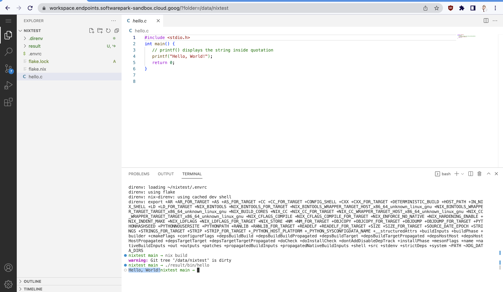

Data Science Platform Workspace
====================================

Quickly launch a secure and flexible VM for data scientists in Google Cloud. This allows them to get started on a project in a familiar and powerful environment.

This setup uses Terraform and Nix to provide webIDE based on vscode-server. For small-scale deployments, it is comparable in speed to a classical VM setup based on Docker or bash scripts. For large-scale deployments (more than 5 workspaces), this setup is more secure and convenient to  maintain. Data scientists could apply their own configurations, while Ops could rebuild the entire fleet with the latest updates and security patches.

## setup content:

[Openvscode server](https://code.visualstudio.com/docs/remote/vscode-server), a service that you can run on a remote development machine, like Google Cloud Compute Instance. It allows you to securely connect to that remote machine from anywhere through a local VS Code client, without the requirement of SSH:

In this setup SSL and http connection serves [nginx web server](https://www.nginx.com/) with [letsencrypt SSL service provider](https://letsencrypt.org/):

* [terraform](https://registry.terraform.io/providers/hashicorp/google/latest/docs) code that creates google cloud resources.
* [nix DSL](https://nixos.wiki/wiki/Overview_of_the_Nix_Language) code that setup compute server and services.

### terraform creates the following resources:

* google compute engine [VM instance](https://cloud.google.com/compute)
* [VPC firewall](https://cloud.google.com/vpc/docs/firewalls#:~:text=VPC%20firewall%20rules%20let%20you,they%20have%20not%20started%20up.) rules sets
* [VPC network IP addresses](https://cloud.google.com/vpc/docs/ip-addresses) (static, standard)
* [Cloud API gateway endpoint](https://cloud.google.com/api-gateway/docs)
* necessary google API services

### VM instance

* based on [NixOS 22.11 (Raccoon)](https://nixos.org/blog/announcements.html#nixos-22.11)
* fully compatible with google cloud
* contain [Direnv](https://direnv.net/) and [Flake](https://nixos.wiki/wiki/Flakes) support out the box
* contain nginx server
* contain openvscode server
* contain ssl configuration
* contain dev tools like git, docker, etc

## NixOS

NixOS is a Linux distribution built around the Nix package manager solving package and configuration management problems in its own unique way. When installing systems running Linux distributions by conventional means, it is common to do activities, such as installing the distribution itself, then installing additional custom packages, modifying configuration files and so on, which is often a tedious, time consuming and error prone process.

There are three ways to install an application on nixos:
* As a system package from imperative package manager 
* In ephemeral shell environments
* In reusable reproducible shell environments

This is an example of how to install go in  ephemeral shell environment:

Or lets install Python3 in reusable reproducible shell environment. Let's take a [dummy repository](https://github.com/krasina15/nixtest)  (this repo contains simple cpp source code, lets build it too) for this example:

As you can see from demonstation above, direnv app allow you to have tools and dependencies on the fly.

Next, lets try to build cpp app from sources.
As we have a [flake file in dummy repo](https://github.com/krasina15/nixtest/blob/main/flake.nix), we have [automation](https://nixos.org/manual/nix/stable/command-ref/new-cli/nix3-build.html) for build process, and we have just exec `nix build`

## How-to install DSP Workspace

0. Setup terrafrom and gcloud cli apps.
1. Setup a GCP project name in terraform variables file.
2. Plan and apply terraform plan from your local environment.
3. Note: after successfully applying the plan, do the following: `terraform state rm google_endpoints_service.telemetry_openapi_service` that's necessary in reason of google endpoint design.

The following Google Cloud APIs will be enabled. In case of troubles you can try to enable them manually:
  * [Service Usage API](https://console.cloud.google.com/apis/library/serviceusage.googleapis.com)
  * [Service Management API](https://console.cloud.google.com/apis/library/servicemanagement.googleapis.com)
  * [Compute Engine API](https://console.cloud.google.com/apis/library/compute.googleapis.com)
  * [Network Management API](https://console.cloud.google.com/apis/library/networkmanagement.googleapis.com)
  * [Cloud Resource Manager API](https://console.cloud.google.com/apis/library/cloudresourcemanager.googleapis.com)

**Important!** Google APIs need up to 10 minutes to activate, please wait 10-15 minutes before next step.

a few minutes your workspace instance will be available in your google cloud project and you can access to your workspace as:
`https://workspace.endpoints.[project_name].cloud.goog/` 
Good luck and enjoy a workspace!

